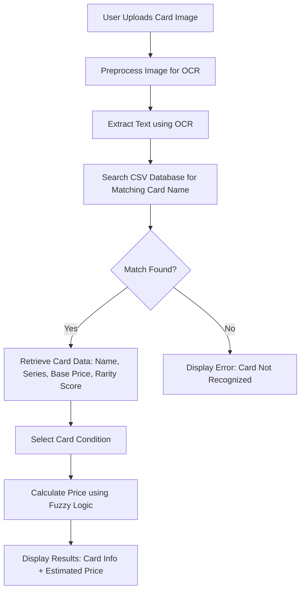

# Plan for Converting Pokemon Card Detector to Image-to-Text Converter

## Current System
The application currently uses ORB feature matching to compare uploaded card images against reference images stored in `data/reference_images/`. Once a match is found, it retrieves card details from `data/cards_database.csv` for price estimation.

## Proposed Changes
- Remove dependency on reference images
- Implement OCR (Optical Character Recognition) to extract text from uploaded card images
- Use extracted text to search for matching card names in the CSV database
- Maintain fuzzy logic price estimation based on card condition and rarity

## Process Flow

## Implementation Steps
1. Add OCR library to requirements.txt
2. Remove ORB detection function
3. Implement text extraction from images
4. Modify card matching logic to use text search
5. Update UI and documentation

## Benefits
- Eliminates need for maintaining reference image library
- More scalable with larger card databases
- Works with any card image as long as text is readable
- Reduces storage requirements